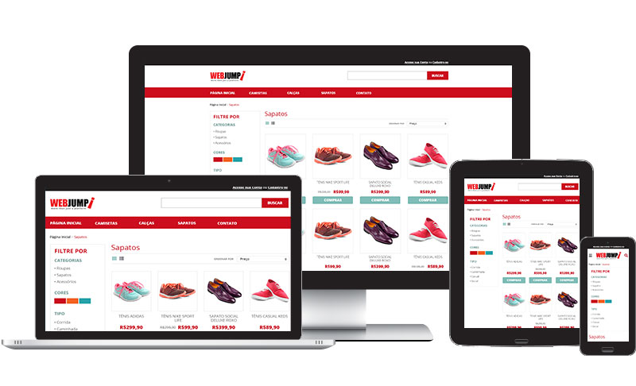

# Desafio Front-end Webjump

Projeto desenvolvido a partir do desafio do processo seletivo para a vaga de Frontend na empresa Webjump. A proposta foi desenvolver uma loja virtual, onde além de listar os produtos divididos em categorias, no qual os diferenciais são os filtros e a responsividade.

## Tecnologias utilizadas

- NextJS 13
- styled-components
- Zustand (Gerenciamento de estado)

## Inicializando o projeto

###### Instalar as dependências

`npm i ou npm install`

###### Inicializar a aplicação

`npm run dev`

